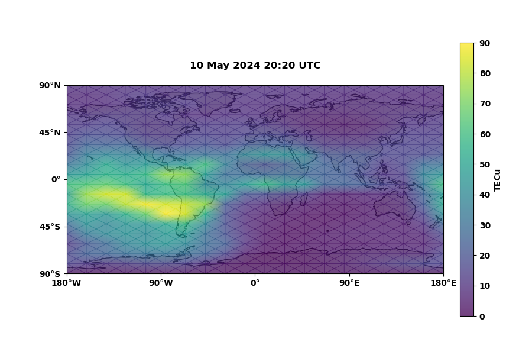

# map_plotter

The package abstracts away some complexity of using the Python packages cartopy/matplotlib for creating global heatmaps / intensity maps of a quantity. 

## Setup

Opinionated recommendation: avoid dependency hell and use conda to create a virtual environment and install cartopy (with precompiled binaries).

```bash
conda install cartopy
```

## Installation

Install this package within the virtual environment:

```bash
pip install .
```

## Usage

Import the module and call the `plot` function as shown below:

```python
import map_plotter
map_plotter.plot(
    lons_g, lats_g, 
    variable, units="m/s", 
    variable_vector,
    img_name="image.png",
    save=True, plot=True, 
    title="something", zlims=[0,10])
```

Whereby: 

- `lons_g` and `lats_g` represent 2D matrices / grids of longitudes and latitudes.
- `variable` is the matrix of scalar values to be plotted (same grid dimensions).
- `variable_vector` is the matrix of values of tuples (u,v) to be plotted (same grid dimensions). If both variable and variable_vector specified, quiver plot is overload onto intensity plot.
- `units` and `img_name` (self explanatory, units apply to scalar variable intensity plot).
- `save` & `plot` boolean flags to save the file and plot to screen, respectively.
- `zlims` define the color scale minimum and maximum.  

## Tests

Install testing dependencies:

```bash
pip install -r tests/requirements.txt
```

Run the test script to visualize ocean current data:

```bash
python tests/check_map.py
```

A map is displayed, and a PNG file is generated in the `tests/` directory.

## Example



_Figure 1: Total electron content of the ionosphere for given date-time as nowcast by the NOAA WAM-IPE model_

## Sponsor

https://amentum.io

